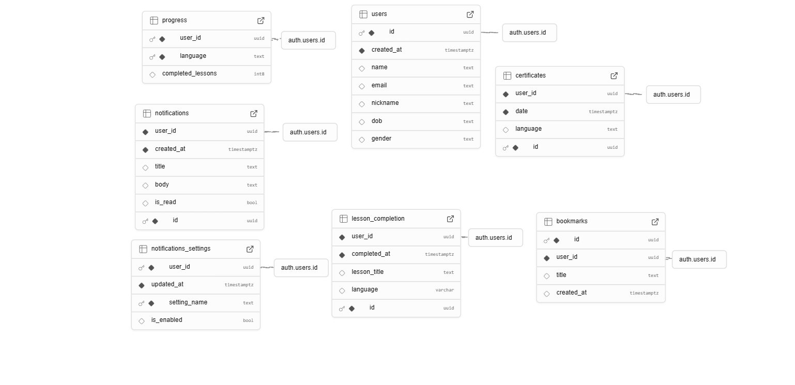

# Code Master

**Code Master** is a mobile application that offers interactive programming courses. The app is designed to make learning to code fun, organized, and efficient. It includes structured video lessons, quizzes, progress tracking, and smart features to enhance the user experience.

---

### Features

**Video Lessons**  
Using the `youtube_player_flutter` package to deliver structured lessons.

**Progress Tracking**  
Track progress for each lesson with a visible progress bar on the Home View.

**Quizzes**  
Short interactive quizzes after each lesson to test understanding.

**Certificate Generation**  
Earn a certificate after completing an entire course.

**Bookmark Feature**  
Save favorite lessons for quick access later.

**Chatbot Assistant**  
Built-in chatbot to support users and answer coding-related questions.

**Online Payment Integration**  
Use the `moyasar` package to securely activate accounts and access full content.

**User Authentication & Profile Page**  
Sign up, log in, and manage profile information.

**Supabase Integration**  
All user data, progress, and authentication are managed via Supabase.

---

### Packages Used

**moyasar**  
Secure online payment integration for activating user accounts.

**introduction_screen**  
Used to create a smooth and interactive onboarding experience for new users.

**image_picker**  
Allows users to select images from the device gallery or take photos using the camera.

**supabase_flutter**  
Handles backend operations including authentication, real-time database, and secure data storage.

**shared_preferences**  
Used to locally save user preferences and track lesson completion progress.

**collection**  
Provides advanced collection functionalities and simplifies data manipulation in the app.

**youtube_player_flutter**  
Integrates YouTube videos directly within the lessons to enhance learning with visual content.

**pin_code_fields**  
Used to build customizable PIN code input fields for secure and user-friendly verification.

---

### Tools Used

- **Frontend:** Flutter (Dart)  
- **Backend:** Supabase (Database, Authentication, Storage)  
- **Video Integration:** `youtube_player_flutter`  
- **Payment Integration:** `moyasar`  
- **Design:** Figma  
- **Management:** GitHub  

---

### App Demo

Watch a short demo of the Code Master application:  
[Click here to view the video](https://drive.google.com/drive/folders/1eavSeUwkqEBqqdc4vSUJJ6zZ0sNgK5_7?usp=sharing)

---

### Presentation  
[Presentation link](https://www.canva.com/design/DAGq6TmN5eE/rEuInX8qaE_k2mB5Gtn1NA/edit?utm_content=DAGq6TmN5eE&utm_campaign=designshare&utm_medium=link2&utm_source=sharebutton)

---

### Figma Design  
You can view the full UI/UX design on Figma:  
[Figma Link](https://www.figma.com/design/SHE9xy6kPBEJf0JzuiSz2v/CodeMaster?node-id=0-1&t=YjbbPprrkDCiHNdA-1)

---

**Database**

---

### Team Members

**Nouf Alfahmi (Leader)**  
**Role**  
- Leading & organizing the team  
- Database integration  
- UI design using Figma  
- Implementing UI/UX in Flutter  

**Contact**  
Email: noufalfahmi1@icloud.com  
GitHub: [https://github.com/Nouf2n](https://github.com/Nouf2n)

---

**Remas Alsubhi**  
**Role**  
- Authentication integration with database  
- Payment integration  
- Implementing UI/UX in Flutter  
- Preparing the presentation and documentation  

**Contact**  
Email: remaslharb55@gmail.com  
GitHub: [https://github.com/remasalharbi](https://github.com/remasalharbi)
---

**Jasser**  
**Role**  
- Designing and implementing the chatbot  
- Code review and bug fixing  

**Contact**  
Email: gaseraz140@gmail.com

---

**Abdulaziz Kariri**  
**Role**  
- Designing and implementing the notifications page  
- Reviewing Supabase integration  

**Contact**  
Email: Abdulaziz.kariri@outlook.com  

